# Adam Asmaca Oyunu

Apache Netbeans kullanılarak geliştirilmiş, kullanıcı dostu bir Adam Asmaca oyunu masaüstü uygulaması.

[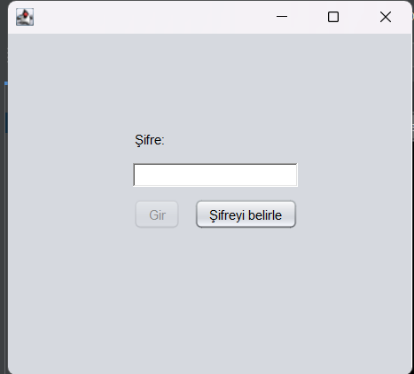](./assets/sifreGirisEkrani.png)

---

## Özellikler

## Özellikler (Features)

### Oyun Mekaniği ve Mantığı
* **Klasik Adam Asmaca Deneyimi:** Rastgele seçilen kelimeleri harf harf tahmin ederek bulmaya çalışma mantığı.
* **Dinamik Hata Takibi:** Yanlış harf tahminlerinde kalan hakların anlık olarak azalması ve adamın çizim aşamalarının adım adım gösterilmesi.
* **Oyun Sonu Senaryoları:** Kazanma ve kaybetme durumlarına özel, kullanıcıyı bilgilendiren ve yeniden oynamaya teşvik eden sonuç ekranları.

### Görsel ve UI (Kullanıcı Arayüzü)
* **Java Swing Entegrasyonu:** Apache NetBeans kullanılarak tasarlanmış, sade ve anlaşılır görsel arayüz.
* **Görsel Geri Bildirim:** Hatalı tahminlere göre değişen, adamın çizimini temsil eden görseller.
* **Klavye Desteği:** (Eğer eklediysen) Sadece ekrandaki butonlara tıklayarak değil, klavye üzerinden de harf girebilme imkanı.

### Veri ve Dosya Yönetimi
* **Kelime Havuzu:** Oyunun kelimeleri belirli bir metin dosyasından okuması (File Handling) sayesinde, kod yapısına dokunmadan kolayca yeni kelimeler eklenebilmesi.

---

## Ekran Görüntüleri

### Boş Şifre Alanı Hatası
[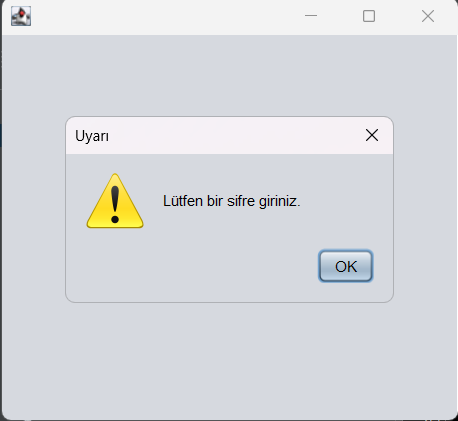](./assets/bosSifreAlani.png)

### Ana Ekran
[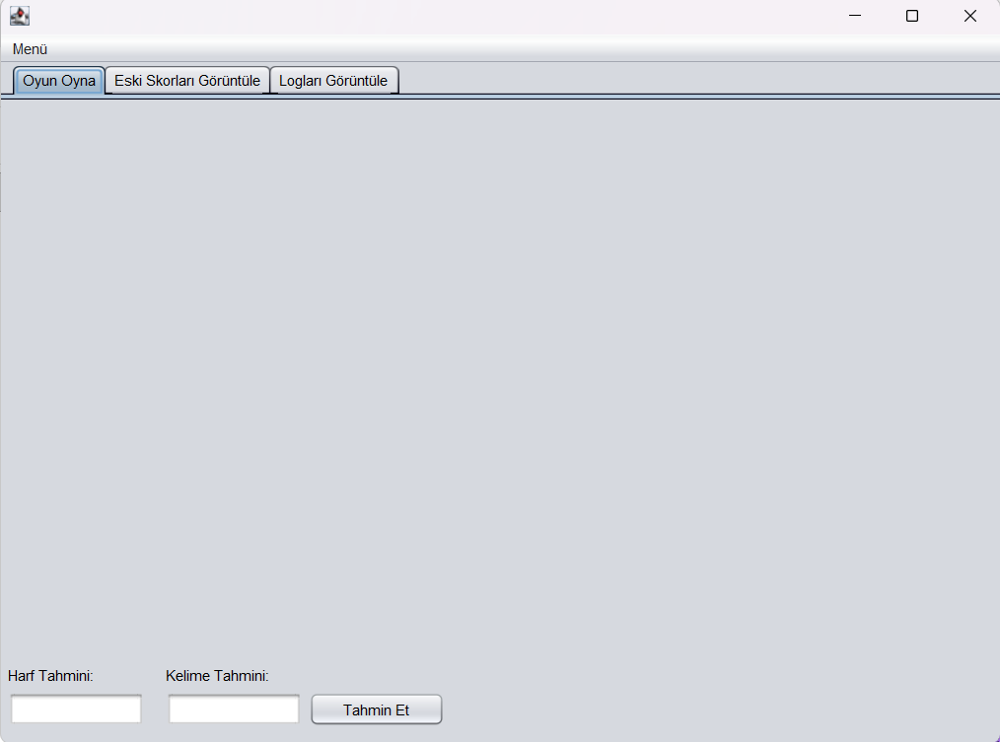](./assets/anaEkran.png)

### Menü
[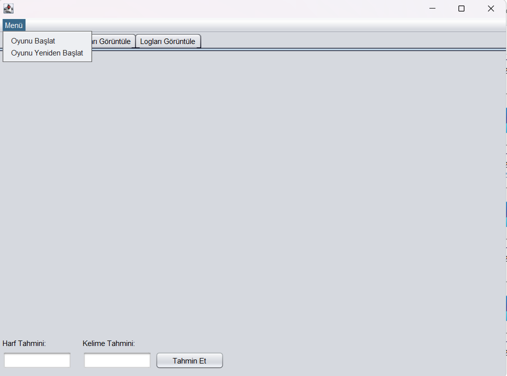](./assets/menu.png)

### Oyun Ekranı
[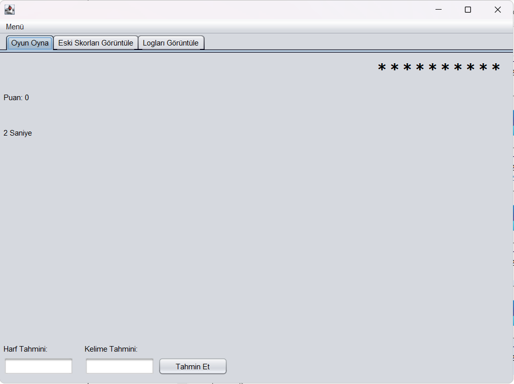](./assets/oyunEkrani.png)

### Oyun Sonu Ekranı
[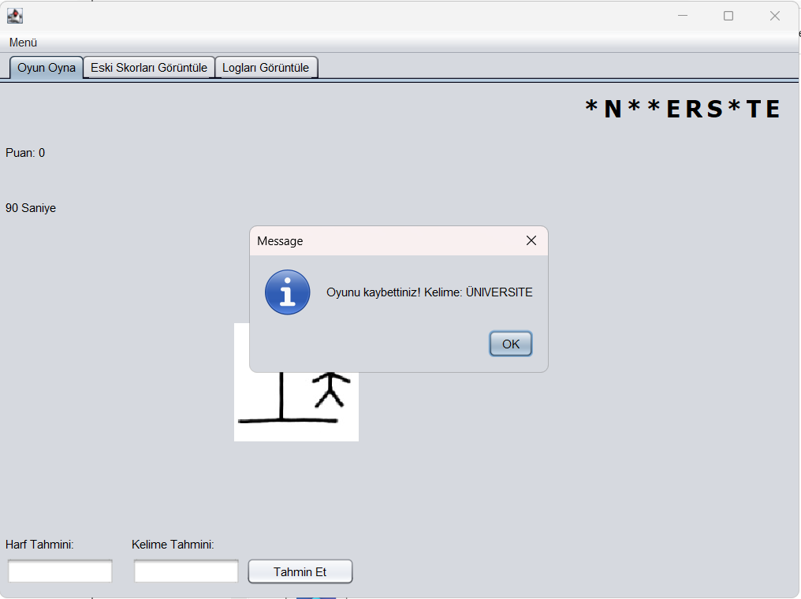](./assets/oyunSonuEkrani.png)

### Skor Ekranı
[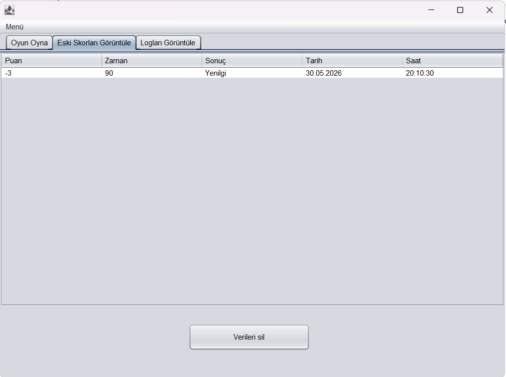](./assets/skorEkrani.png)

### Log Ekranı
[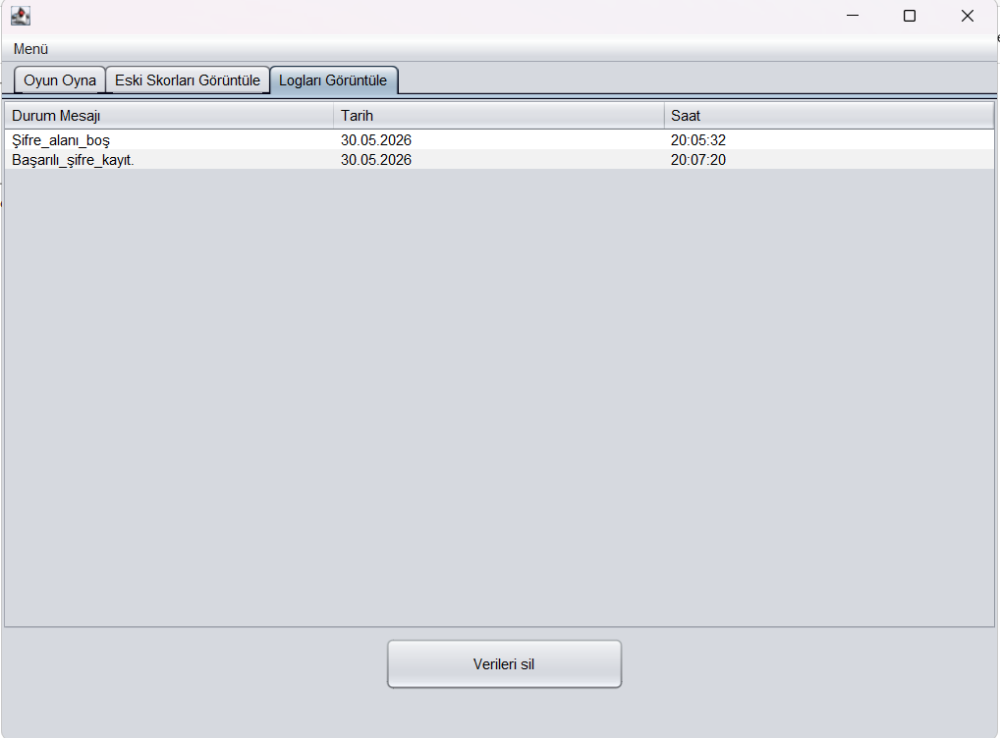](./assets/logEkrani.png)

### Veri Silme
[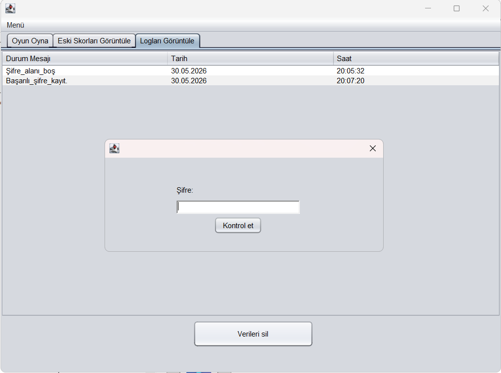](./assets/veriSilme.png)

---

## Demo

### Giriş Ekranı
[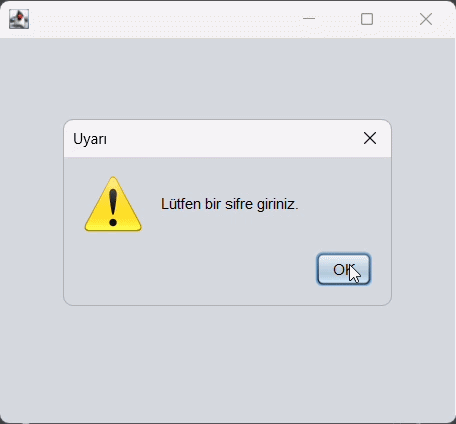](./assets/girisEkraniVideo-ezgif.com-video-to-gif-converter.gif)

### Oyun Ekranı
[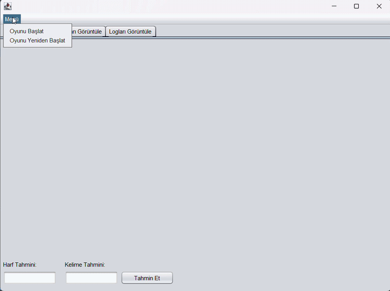](./assets/oyunEkraniVideo-ezgif.com-video-to-gif-converter.gif)

### Skor Ekranı
[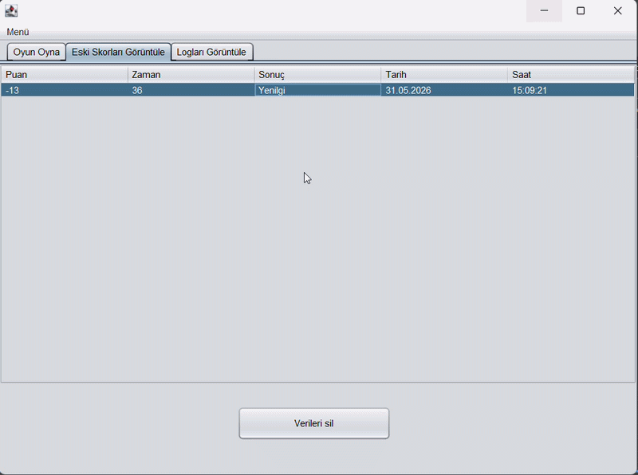](./assets/skorEkraniVideo-ezgif.com-video-to-gif-converter.gif)

### Log Ekranı
[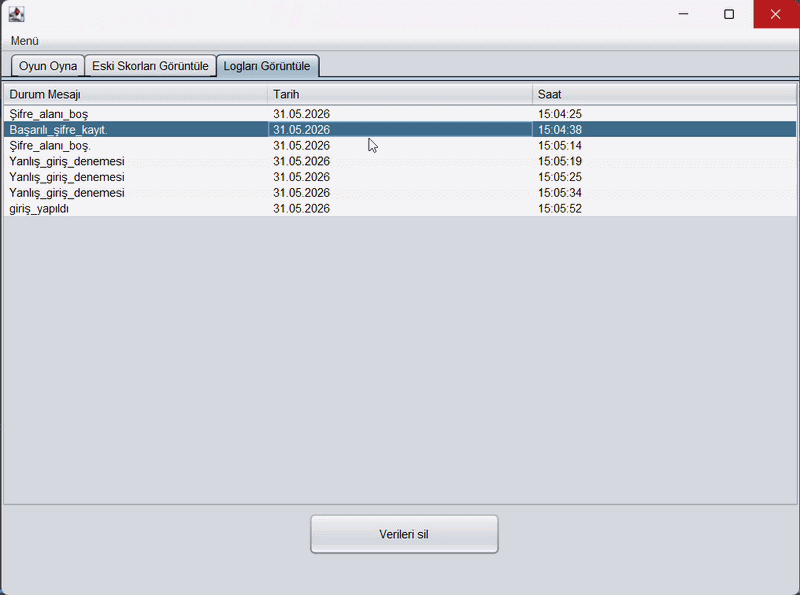](./assets/logEkraniVideo-ezgif.com-video-to-gif-converter.gif)

---

## Mimari (Architecture)

Proje, bağımlılık yönetimi için **Maven** altyapısını kullanmaktadır. Kullanıcı arayüzü (GUI) bileşenleri ile kod mantığı standart Java paketleme mimarisine uygun olarak düzenlenmiştir.

```text
adamAsmaca/
├── assets/                              # README dosyasında kullanılan ekran görüntüleri ve tanıtım medyaları
├── src/                                 # Kaynak kodlarının bulunduğu ana dizin
│   ├── main/java/com/mycompany/adamasmaca/  # Uygulamanın ana paketi
│   │   ├── GUI.java                     # Oyunun ana arayüzünü ve temel oyun mantığını barındıran sınıf
│   │   ├── GUI.form                     # NetBeans GUI Builder ana ekran tasarım dosyası
│   │   ├── Register.java                # Yeni kullanıcı kayıt ekranı arayüzü ve işlemleri
│   │   ├── Register.form                # Kayıt ekranı tasarım dosyası
│   │   ├── passwordCheck.java           # Kullanıcı girişi ve şifre doğrulama ekranı
│   │   └── passwordCheck.form           # Giriş ekranı tasarım dosyası
│   │
│   └── test/                            # (Gelecekte eklenebilecek) Birim test (Unit Test) dosyaları dizini
│
├── target/                              # Derlenmiş sınıf dosyaları ve dağıtıma hazır .jar dosyasının çıktığı dizin
├── pom.xml                              # Maven proje konfigürasyonu ve dış bağımlılıkların yönetildiği dosya
└── nbactions.xml                        # NetBeans IDE'sine özel çalıştırma ve derleme ayarları
```

---

## Nasıl Çalıştırılır?

> Java Development Kit (JDK): JDK 25 ya da üzeri.

## Kurulum ve Çalıştırma Adımları

**Adım 1:** Repoyu bilgisayarınıza klonlayın.
```bash
   git clone [https://github.com/bayyazar/Adam_Asmaca_Uygulamasi.git](https://github.com/bayyazar/Adam_Asmaca_Uygulamasi.git)
```
**Adım 2:** C: içerisine P2Oyun adlı bir dosya oluşturun. Dosyanın içerisine kelimeler.txt, log.txt, oyunlar.txt ve sifre.txt dökümanlarını ekleyin
ve kelimeler.txt içerisine kelimeleri ekleyin.

**Adım 3:** Apache NetBeans'i açın.

**Adım 4:** Üst menüden File > Open Project (Dosya > Projeyi Aç) yolunu izleyin ve klonladığınız proje klasörünü seçin.

**Adım 5:** (Opsiyonel - Eğer dış kütüphane varsa) Projeye sağ tıklayıp Properties > Libraries bölümünden gerekli .jar dosyalarının (örn: MySQL Connector) 
eklendiğinden emin olun.

**Adım 6:** Projeye sağ tıklayıp Clean and Build (Temizle ve Derle) seçeneğine tıklayın. Bu işlem dist klasörü içinde projenin .jar dosyasını oluşturacaktır.

**Adım 7:** Projeye tekrar sağ tıklayıp Run (Çalıştır) seçeneğine basarak (veya doğrudan F6 tuşuyla) uygulamayı başlatın.

## Kullanılan teknolojiler

-Java
-Java Swing (GUI Builder)
-Apache NetBeans IDE
